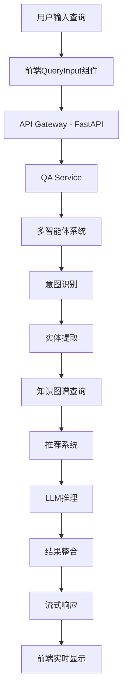
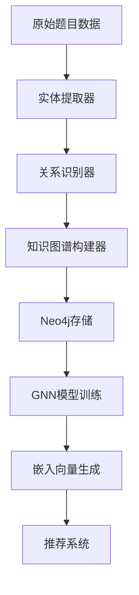
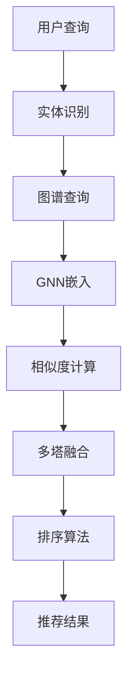

# AlgoKG智能问答系统 - 详细项目说明文档

## 项目概述

AlgoKG是一个基于知识图谱的智能算法学习助手，集成了多智能体协作推理、图神经网络增强推荐、实时流式响应和知识图谱可视化等先进技术。系统旨在为算法学习者提供个性化、交互式的学习体验。

### 核心价值
- **智能化学习路径**: 基于知识图谱的个性化推荐
- **实时推理展示**: 可视化AI思考过程，增强学习理解
- **交互式内容**: 点击式概念和题目跳转，无缝学习体验
- **多模态融合**: 结构化知识+文本语义+标签特征的深度融合

## 技术架构

### 整体架构图
```
┌─────────────────────────────────────────────────────────────┐
│                    前端层 (React + TypeScript)                │
├─────────────────────────────────────────────────────────────┤
│  ┌─────────────┐  ┌─────────────┐  ┌─────────────┐         │
│  │ 智能问答界面  │  │ 知识图谱可视化 │  │ 算法可视化实验室 │         │
│  └─────────────┘  └─────────────┘  └─────────────┘         │
├─────────────────────────────────────────────────────────────┤
│                    API网关层 (FastAPI)                       │
├─────────────────────────────────────────────────────────────┤
│  ┌─────────────┐  ┌─────────────┐  ┌─────────────┐         │
│  │   问答API    │  │   图谱API    │  │   推荐API    │         │
│  └─────────────┘  └─────────────┘  └─────────────┘         │
├─────────────────────────────────────────────────────────────┤
│                    业务逻辑层                                │
├─────────────────────────────────────────────────────────────┤
│  ┌─────────────┐  ┌─────────────┐  ┌─────────────┐         │
│  │ 多智能体系统  │  │ 图神经网络模型 │  │ 知识图谱引擎  │         │
│  └─────────────┘  └─────────────┘  └─────────────┘         │
├─────────────────────────────────────────────────────────────┤
│                    数据存储层                                │
├─────────────────────────────────────────────────────────────┤
│  ┌─────────────┐  ┌─────────────┐  ┌─────────────┐         │
│  │   Neo4j     │  │    Redis     │  │  文件存储    │         │
│  │  (知识图谱)   │  │   (缓存)     │  │ (模型/数据)   │         │
│  └─────────────┘  └─────────────┘  └─────────────┘         │
└─────────────────────────────────────────────────────────────┘
```

### 技术栈详情

#### 前端技术栈
- **React 18**: 现代化前端框架，支持并发特性
- **TypeScript**: 类型安全，提升开发效率和代码质量
- **Ant Design**: 企业级UI组件库，提供丰富的交互组件
- **Zustand**: 轻量级状态管理，替代Redux
- **D3.js + Vis.js**: 图谱可视化，支持力导向布局和交互
- **Framer Motion**: 动画库，提升用户体验
- **React Query**: 数据获取和缓存管理
- **Styled Components**: CSS-in-JS解决方案

#### 后端技术栈
- **FastAPI**: 高性能异步Web框架，自动生成API文档
- **Pydantic**: 数据验证和序列化
- **WebSocket**: 实时通信支持，用于流式响应
- **Neo4j**: 图数据库，存储知识图谱
- **Redis**: 内存数据库，用于缓存和会话管理
- **PyTorch**: 深度学习框架，支持GNN模型
- **PyTorch Geometric**: 图神经网络库

#### AI/ML技术栈
- **通义千问 (Qwen)**: 大语言模型，提供智能问答能力
- **GATv2**: 图注意力网络，用于节点表示学习
- **Multi-Tower架构**: 多塔模型，融合结构化和非结构化特征
- **BERT**: 文本编码，提取语义特征

## 核心功能模块

### 1. 智能问答系统

#### 功能特点
- **多轮对话**: 支持上下文理解和会话管理
- **实时推理**: 流式返回推理过程，展示AI思考路径
- **交互式内容**: 支持概念和题目的点击跳转
- **多种查询类型**: 概念解释、题目推荐、相似题目查找等

#### 核心代码实现

**多智能体协作系统** (`qa/multi_agent_qa.py`)
```python
class GraphEnhancedMultiAgentSystem:
    def __init__(self, rec_system=None, neo4j_api=None, entity_id_to_title_path=None, qwen_client=None):
        self.rec_system = rec_system
        self.neo4j_api = neo4j_api
        self.qwen_client = qwen_client
        self.entity_id_to_title = self._load_entity_mapping(entity_id_to_title_path)
        
    async def process_query(self, query: str) -> Dict[str, Any]:
        """处理用户查询的主要入口"""
        # 1. 意图识别
        intent = await self._classify_intent(query)
        
        # 2. 实体提取
        entities = await self._extract_entities(query)
        
        # 3. 多智能体协作推理
        reasoning_steps = []
        
        if intent == "concept_explanation":
            result = await self._handle_concept_explanation(query, entities, reasoning_steps)
        elif intent == "problem_recommendation":
            result = await self._handle_problem_recommendation(query, entities, reasoning_steps)
        elif intent == "similar_problems":
            result = await self._handle_similar_problems(query, entities, reasoning_steps)
        else:
            result = await self._handle_general_query(query, entities, reasoning_steps)
            
        return {
            "intent": intent,
            "entities": entities,
            "reasoning_steps": reasoning_steps,
            "integrated_response": result["response"],
            "recommendations": result.get("recommendations", []),
            "graph_data": result.get("graph_data"),
            "metadata": result.get("metadata", {})
        }
```

**流式响应处理** (`web_app/backend/app/api/qa.py`)
```python
@router.post("/stream")
async def stream_query(
    request: QARequest,
    qa_service: QAService = Depends(get_qa_service)
):
    """流式问答接口"""
    async def generate_stream():
        try:
            async for chunk in qa_service.process_query_stream(request):
                # 转换为SSE格式
                data = json.dumps(chunk.dict(), ensure_ascii=False, default=json_serializer)
                yield f"data: {data}\n\n"
        except Exception as e:
            error_chunk = StreamingResponse(
                type="error",
                content={"error": str(e)},
                step_id="error",
                timestamp=datetime.now().isoformat()
            )
            data = json.dumps(error_chunk.dict(), ensure_ascii=False)
            yield f"data: {data}\n\n"
        finally:
            yield "data: [DONE]\n\n"
    
    return FastAPIStreamingResponse(
        generate_stream(),
        media_type="text/plain",
        headers={
            "Cache-Control": "no-cache",
            "Connection": "keep-alive",
            "Content-Type": "text/event-stream"
        }
    )
```

### 2. 知识图谱系统

#### 功能特点
- **多数据源融合**: Neo4j实时数据 + 嵌入向量推荐 + 静态知识
- **动态可视化**: 支持力导向布局、层次布局等多种展示方式
- **交互式探索**: 节点点击、缩放、拖拽等交互功能
- **实时查询**: 基于Cypher的高效图查询

#### 核心代码实现

**Neo4j图谱查询** (`web_app/backend/app/api/graph.py`)
```python
class Neo4jGraphVisualizer:
    def query_graph_data(self, center_entity: str, entity_type: str = None, depth: int = 2, limit: int = 50) -> GraphData:
        """查询图谱数据用于可视化"""
        # 构建Cypher查询
        if entity_type == "Problem":
            cypher = self._build_problem_graph_query(center_entity, depth, limit)
        elif entity_type == "Algorithm":
            cypher = self._build_algorithm_graph_query(center_entity, depth, limit)
        elif entity_type == "DataStructure":
            cypher = self._build_data_structure_graph_query(center_entity, depth, limit)
        else:
            cypher = self._build_general_graph_query(center_entity, depth, limit)

        # 执行查询并转换为图数据
        results = self.neo4j_api.run_query(cypher, params)
        return self._convert_to_graph_data(results, center_entity)
    
    def _build_problem_graph_query(self, problem_title: str, depth: int, limit: int) -> str:
        """构建题目相关的图谱查询"""
        return """
        MATCH (p:Problem {title: $problem_title})
        OPTIONAL MATCH (p)-[r1:USES_ALGORITHM]->(a:Algorithm)
        OPTIONAL MATCH (p)-[r2:USES_DATA_STRUCTURE]->(ds:DataStructure)
        OPTIONAL MATCH (p)-[r3:USES_TECHNIQUE]->(t:Technique)
        OPTIONAL MATCH (p)-[r4:SIMILAR_TO]->(sp:Problem)
        OPTIONAL MATCH (p)-[r5:HAS_DIFFICULTY]->(d:Difficulty)
        OPTIONAL MATCH (p)-[r6:BELONGS_TO_PLATFORM]->(pl:Platform)
        
        WITH p, collect(DISTINCT {node: a, rel: r1, type: 'Algorithm'}) as algorithms,
             collect(DISTINCT {node: ds, rel: r2, type: 'DataStructure'}) as data_structures,
             collect(DISTINCT {node: t, rel: r3, type: 'Technique'}) as techniques,
             collect(DISTINCT {node: sp, rel: r4, type: 'Problem'}) as similar_problems,
             collect(DISTINCT {node: d, rel: r5, type: 'Difficulty'}) as difficulties,
             collect(DISTINCT {node: pl, rel: r6, type: 'Platform'}) as platforms
        
        RETURN p, algorithms, data_structures, techniques, similar_problems, difficulties, platforms
        LIMIT $limit
        """
```

**前端图谱可视化** (`web_app/frontend/src/components/graph/EnhancedGraphVisualization.tsx`)
```typescript
const EnhancedGraphVisualization: React.FC<GraphVisualizationProps> = ({
  data,
  onNodeClick,
  onEdgeClick,
  layout = 'force'
}) => {
  const containerRef = useRef<HTMLDivElement>(null);
  const networkRef = useRef<Network | null>(null);

  useEffect(() => {
    if (!data || !containerRef.current) return;

    // 转换数据格式
    const visData = convertDataForVis(data);
    
    // 配置网络选项
    const options = getNetworkOptions(layout);
    
    // 创建网络实例
    const network = new Network(containerRef.current, visData, options);
    networkRef.current = network;

    // 绑定事件
    network.on('click', (params) => {
      if (params.nodes.length > 0) {
        const nodeId = params.nodes[0];
        const node = data.nodes.find(n => n.id === nodeId);
        if (node && onNodeClick) {
          onNodeClick(node);
        }
      }
    });

    // 启动动画
    startAnimation();

    return () => {
      network.destroy();
    };
  }, [data, layout, onNodeClick]);

  return (
    <div className="graph-visualization">
      <div ref={containerRef} className="graph-container" />
      <GraphControls
        onLayoutChange={setLayout}
        onZoomIn={() => networkRef.current?.moveTo({ scale: 1.2 })}
        onZoomOut={() => networkRef.current?.moveTo({ scale: 0.8 })}
        onFitView={() => networkRef.current?.fit()}
      />
    </div>
  );
};
```

### 3. 图神经网络推荐系统

#### 功能特点
- **多塔架构**: 结构化特征塔 + 标签特征塔 + 文本特征塔
- **GATv2网络**: 图注意力机制，学习节点表示
- **多任务学习**: 同时优化推荐和标签预测任务
- **集成学习**: 多模型融合提升推荐效果

#### 核心代码实现

**多塔GNN模型** (`gnn_model/train_multitask_gat2v.py`)
```python
class MultiTowerGNN(nn.Module):
    def __init__(self, in_dim, tag_dim, bert_dim, out_dim=128, hid_dim=256, num_heads=8, dropout=0.2):
        super().__init__()
        # GNN塔 - 学习结构化特征
        self.gnn_layers = nn.ModuleList([
            GATv2Conv(in_dim, hid_dim, heads=num_heads, dropout=dropout),
            GATv2Conv(hid_dim * num_heads, hid_dim, heads=num_heads, dropout=dropout),
            GATv2Conv(hid_dim * num_heads, out_dim, heads=1, dropout=dropout),
        ])
        self.bn = nn.ModuleList([nn.BatchNorm1d(hid_dim*num_heads), nn.BatchNorm1d(hid_dim*num_heads)])
        self.proj = nn.Linear(in_dim, hid_dim*num_heads)

        # 标签塔 - 学习标签特征
        self.tag_encoder = nn.Sequential(
            nn.Linear(tag_dim, hid_dim), nn.ReLU(),
            nn.Linear(hid_dim, out_dim)
        )
        
        # 文本塔 - 学习语义特征
        self.txt_encoder = nn.Sequential(
            nn.Linear(bert_dim, hid_dim), nn.ReLU(),
            nn.Linear(hid_dim, out_dim)
        )
        
        # 融合层
        self.fusion = nn.Sequential(
            nn.Linear(out_dim * 3, hid_dim), nn.ReLU(),
            nn.Linear(hid_dim, out_dim)
        )
        
        # 标签预测头
        self.tag_pred = nn.Linear(out_dim, tag_dim)
        self.dropout = nn.Dropout(dropout)

    def forward(self, data, tag_feat, txt_feat):
        x, edge_index = data.x, data.edge_index
        
        # GNN塔前向传播
        h = x
        for i, conv in enumerate(self.gnn_layers):
            h = F.elu(conv(h, edge_index))
            if i < len(self.bn):
                h = self.bn[i](h)
            h = self.dropout(h)
            if i == 0:
                h = h + self.proj(x)  # 残差连接
        z_struct = h
        
        # 其他塔的前向传播
        z_tag = self.tag_encoder(tag_feat)
        z_txt = self.txt_encoder(txt_feat)
        
        # 特征融合
        z_fusion = self.fusion(torch.cat([z_struct, z_tag, z_txt], dim=1))
        
        # 标签预测
        tag_logits = self.tag_pred(z_fusion)
        
        return z_struct, z_tag, z_txt, z_fusion, tag_logits
```

**推荐服务** (`qa/embedding_qa.py`)
```python
class EnhancedRecommendationSystem:
    def __init__(self, embedding_path, entity2id_path, id2title_path, tag_label_path):
        self.device = torch.device("cuda" if torch.cuda.is_available() else "cpu")
        self.embeddings = torch.load(embedding_path, map_location=self.device)
        self.entity2id = self._load_json(entity2id_path)
        self.id2title = self._load_json(id2title_path)
        self.tag_labels = self._load_json(tag_label_path)
        
    def get_recommendations(self, query_title: str, k: int = 10) -> List[Dict[str, Any]]:
        """获取推荐题目"""
        if query_title not in self.entity2id:
            return []
            
        query_id = self.entity2id[query_title]
        query_embedding = self.embeddings[query_id].unsqueeze(0)
        
        # 计算相似度
        similarities = torch.cosine_similarity(query_embedding, self.embeddings, dim=1)
        
        # 获取top-k推荐
        top_k_indices = similarities.topk(k + 1).indices[1:]  # 排除自身
        
        recommendations = []
        for idx in top_k_indices:
            item_id = idx.item()
            if str(item_id) in self.id2title:
                title = self.id2title[str(item_id)]
                similarity = similarities[idx].item()
                tags = self.tag_labels.get(str(item_id), [])
                
                recommendations.append({
                    "title": title,
                    "similarity_score": similarity,
                    "tags": tags,
                    "id": item_id
                })

        return recommendations

### 4. 数据提取与知识图谱构建

#### 功能特点
- **批量实体提取**: 从算法题目中提取算法、数据结构、技术等实体
- **关系识别**: 自动识别实体间的语义关系
- **知识图谱构建**: 将提取的实体和关系存储到Neo4j
- **增量更新**: 支持新题目的动态添加

#### 核心代码实现

**实体提取器** (`extractors/extract_knowledgePoint.py`)
```python
class KnowledgePointExtractor:
    def __init__(self, api_key: str):
        self.client = QwenClient(api_key)
        self.patterns = self._load_patterns()

    async def extract_knowledge_point(self, content: str, filename: str) -> Dict[str, Any]:
        """提取知识点"""
        # 1. 预处理内容
        processed_content = self.preprocess_content(content)

        # 2. 使用LLM提取结构化信息
        prompt = self._build_extraction_prompt(processed_content)
        response = await self.client.generate_response(prompt)

        # 3. 解析和验证结果
        knowledge_point = self._parse_response(response)

        # 4. 后处理和增强
        enhanced_kp = self._enhance_knowledge_point(knowledge_point, content)

        return enhanced_kp

    def _build_extraction_prompt(self, content: str) -> str:
        """构建提取提示词"""
        return f"""
        请从以下算法题目内容中提取结构化的知识点信息：

        题目内容：
        {content}

        请按照以下JSON格式返回：
        {{
            "title": "题目标题",
            "difficulty": "简单/中等/困难",
            "algorithms": ["算法1", "算法2"],
            "data_structures": ["数据结构1", "数据结构2"],
            "techniques": ["技巧1", "技巧2"],
            "time_complexity": "时间复杂度",
            "space_complexity": "空间复杂度",
            "tags": ["标签1", "标签2"],
            "description": "题目描述",
            "solution_approach": "解题思路"
        }}
        """
```

**批量图谱构建器** (`backend/neo4j_loader/extractor2_modified.py`)
```python
class BatchKnowledgeGraphBuilder:
    def __init__(self, neo4j_uri: str, neo4j_user: str, neo4j_password: str):
        self.entity_extractor = BatchEntityExtractor()
        self.relationship_extractor = BatchRelationshipExtractor()
        self.graph_db = ExtendedNeo4jKnowledgeGraph(neo4j_uri, neo4j_user, neo4j_password)

    def build_from_directory(self, root_directory: str, file_pattern: str = "*.json",
                           batch_size: int = 10, max_workers: int = 4) -> Dict[str, Any]:
        """从目录批量构建知识图谱"""
        json_files = list(Path(root_directory).rglob(file_pattern))

        total_entities = 0
        total_relationships = 0
        processed_files = 0
        categories = {}

        # 分批处理文件
        for i in range(0, len(json_files), batch_size):
            batch_files = json_files[i:i + batch_size]

            # 并行处理批次
            with ThreadPoolExecutor(max_workers=max_workers) as executor:
                futures = [executor.submit(self._process_file, file_path) for file_path in batch_files]

                for future in as_completed(futures):
                    try:
                        result = future.result()
                        if result['status'] == 'success':
                            total_entities += result['entities_added']
                            total_relationships += result['relationships_added']
                            processed_files += 1

                            # 更新分类统计
                            category = result.get('category')
                            if category:
                                if category not in categories:
                                    categories[category] = CategoryInfo(category, 0, [])
                                categories[category].problem_count += 1

                    except Exception as e:
                        logger.error(f"处理文件失败: {e}")

        return {
            'total_entities': total_entities,
            'total_relationships': total_relationships,
            'processed_files': processed_files,
            'categories': categories,
            'statistics': self._generate_statistics()
        }
```

### 5. 前端用户界面

#### 功能特点
- **现代化设计**: ChatGPT风格的对话界面
- **实时交互**: 流式响应显示，实时推理路径
- **多主题支持**: 浅色/深色主题切换
- **响应式布局**: 支持桌面端和移动端
- **交互式图谱**: 支持缩放、拖拽、节点点击等操作

#### 核心代码实现

**状态管理** (`web_app/frontend/src/store/appStore.ts`)
```typescript
interface AppState {
  // 聊天相关状态
  messages: ChatMessage[];
  currentQuery: string;
  isLoading: boolean;
  isStreaming: boolean;
  sessionId: string;

  // UI状态
  theme: 'light' | 'dark';
  sidebarCollapsed: boolean;
  activeTab: string;

  // 图谱相关状态
  graphData: GraphData | null;
  selectedNode: GraphNode | null;

  // 错误处理
  error: string | undefined;
  abortController: AbortController | null;
}

const useAppStore = create<AppState & AppActions>((set, get) => ({
  // 初始状态
  messages: [],
  currentQuery: '',
  isLoading: false,
  isStreaming: false,
  sessionId: generateSessionId(),
  theme: 'light',
  sidebarCollapsed: false,
  activeTab: 'chat',
  graphData: null,
  selectedNode: null,
  error: undefined,
  abortController: null,

  // Actions
  setCurrentQuery: (query) => set({ currentQuery: query }),
  setLoading: (loading) => set({ isLoading: loading }),
  setStreaming: (streaming) => set({ isStreaming: streaming }),

  addMessage: (message) => set((state) => ({
    messages: [...state.messages, message]
  })),

  updateMessage: (messageId, updates) => set((state) => ({
    messages: state.messages.map(msg =>
      msg.id === messageId ? { ...msg, ...updates } : msg
    )
  })),

  handleStreamingStep: (chunk) => {
    const state = get();

    if (chunk.type === 'reasoning_step') {
      // 更新推理步骤
      const lastMessage = state.messages[state.messages.length - 1];
      if (lastMessage && lastMessage.type === 'assistant') {
        const updatedSteps = [...(lastMessage.reasoning_steps || []), chunk.content];
        set((state) => ({
          messages: state.messages.map((msg, index) =>
            index === state.messages.length - 1
              ? { ...msg, reasoning_steps: updatedSteps }
              : msg
          )
        }));
      }
    } else if (chunk.type === 'final_response') {
      // 最终响应
      const assistantMessage: ChatMessage = {
        id: generateId(),
        type: 'assistant',
        content: chunk.content.integrated_response,
        timestamp: new Date().toISOString(),
        session_id: state.sessionId,
        recommendations: chunk.content.recommendations,
        graph_data: chunk.content.graph_data,
        reasoning_steps: chunk.content.reasoning_steps
      };

      set((state) => ({
        messages: [...state.messages, assistantMessage],
        graphData: chunk.content.graph_data || state.graphData
      }));
    }
  }
}));
```

**消息组件** (`web_app/frontend/src/components/chat/MessageItem.tsx`)
```typescript
const MessageItem: React.FC<MessageItemProps> = ({
  message,
  onConceptClick,
  onProblemClick
}) => {
  const [expandedSteps, setExpandedSteps] = useState(false);

  const renderContent = () => {
    if (message.type === 'user') {
      return (
        <div className="user-message">
          <div className="message-avatar">
            <UserOutlined />
          </div>
          <div className="message-content">
            <ReactMarkdown>{message.content}</ReactMarkdown>
          </div>
        </div>
      );
    }

    return (
      <div className="assistant-message">
        <div className="message-avatar">
          <RobotOutlined />
        </div>
        <div className="message-content">
          {/* 推理步骤 */}
          {message.reasoning_steps && message.reasoning_steps.length > 0 && (
            <div className="reasoning-section">
              <Button
                type="text"
                size="small"
                icon={expandedSteps ? <UpOutlined /> : <DownOutlined />}
                onClick={() => setExpandedSteps(!expandedSteps)}
              >
                推理过程 ({message.reasoning_steps.length} 步)
              </Button>

              {expandedSteps && (
                <div className="reasoning-steps">
                  {message.reasoning_steps.map((step, index) => (
                    <div key={index} className="reasoning-step">
                      <div className="step-header">
                        <span className="step-number">{index + 1}</span>
                        <span className="step-title">{step.title}</span>
                      </div>
                      <div className="step-content">
                        <ReactMarkdown>{step.content}</ReactMarkdown>
                      </div>
                    </div>
                  ))}
                </div>
              )}
            </div>
          )}

          {/* 主要回答 */}
          <div className="main-response">
            <ReactMarkdown
              components={{
                a: ({ href, children }) => {
                  if (href?.startsWith('concept:')) {
                    const concept = href.replace('concept:', '');
                    return (
                      <Button
                        type="link"
                        size="small"
                        onClick={() => onConceptClick?.(concept)}
                      >
                        {children}
                      </Button>
                    );
                  } else if (href?.startsWith('problem:')) {
                    const problem = href.replace('problem:', '');
                    return (
                      <Button
                        type="link"
                        size="small"
                        onClick={() => onProblemClick?.(problem)}
                      >
                        {children}
                      </Button>
                    );
                  }
                  return <a href={href} target="_blank" rel="noopener noreferrer">{children}</a>;
                }
              }}
            >
              {message.content}
            </ReactMarkdown>
          </div>

          {/* 推荐卡片 */}
          {message.recommendations && message.recommendations.length > 0 && (
            <div className="recommendations-section">
              <h4>相关推荐</h4>
              <div className="recommendation-cards">
                {message.recommendations.map((rec, index) => (
                  <RecommendationCard
                    key={index}
                    recommendation={rec}
                    onClick={() => onProblemClick?.(rec.title)}
                  />
                ))}
              </div>
            </div>
          )}
        </div>
      </div>
    );
  };

  return (
    <div className={`message-item ${message.type}`}>
      {renderContent()}
      <div className="message-timestamp">
        {new Date(message.timestamp).toLocaleTimeString()}
      </div>
    </div>
  );
};
```

## 数据流架构

### 1. 用户查询处理流程



### 2. 知识图谱构建流程



### 3. 推荐系统架构



## 部署架构

### 开发环境
```yaml
services:
  frontend:
    build: ./web_app/frontend
    ports:
      - "3000:3000"
    environment:
      - REACT_APP_API_URL=http://localhost:8000

  backend:
    build: ./web_app/backend
    ports:
      - "8000:8000"
    environment:
      - NEO4J_URI=bolt://neo4j:7687
      - REDIS_URL=redis://redis:6379
    depends_on:
      - neo4j
      - redis

  neo4j:
    image: neo4j:5.0
    ports:
      - "7474:7474"
      - "7687:7687"
    environment:
      - NEO4J_AUTH=neo4j/123456
    volumes:
      - neo4j_data:/data

  redis:
    image: redis:7-alpine
    ports:
      - "6379:6379"
    volumes:
      - redis_data:/data

volumes:
  neo4j_data:
  redis_data:
```

### 生产环境
- **容器化部署**: Docker + Kubernetes
- **负载均衡**: Nginx + HAProxy
- **数据库集群**: Neo4j集群 + Redis Cluster
- **监控系统**: Prometheus + Grafana
- **日志收集**: ELK Stack

## 性能优化

### 1. 前端优化
- **代码分割**: React.lazy + Suspense
- **缓存策略**: React Query + Service Worker
- **虚拟化**: 大列表虚拟滚动
- **图谱优化**: WebGL渲染 + LOD技术

### 2. 后端优化
- **异步处理**: FastAPI异步特性
- **连接池**: 数据库连接池管理
- **缓存层**: Redis多级缓存
- **批处理**: 批量数据处理

### 3. 数据库优化
- **索引优化**: Neo4j复合索引
- **查询优化**: Cypher查询优化
- **分片策略**: 数据分片存储
- **预计算**: 常用查询结果预计算

## 安全机制

### 1. 认证授权
- **JWT Token**: 用户身份认证
- **RBAC**: 基于角色的访问控制
- **API限流**: 防止恶意请求
- **CORS配置**: 跨域安全策略

### 2. 数据安全
- **数据加密**: 敏感数据加密存储
- **SQL注入防护**: 参数化查询
- **XSS防护**: 输入输出过滤
- **CSRF防护**: Token验证

### 3. 系统安全
- **容器安全**: 最小权限原则
- **网络隔离**: VPC + 安全组
- **日志审计**: 操作日志记录
- **备份恢复**: 定期数据备份

## 监控与运维

### 1. 应用监控
- **性能指标**: 响应时间、吞吐量、错误率
- **业务指标**: 用户活跃度、查询成功率
- **资源监控**: CPU、内存、磁盘使用率
- **告警机制**: 异常自动告警

### 2. 日志管理
- **结构化日志**: JSON格式日志
- **日志聚合**: 集中式日志收集
- **日志分析**: 实时日志分析
- **日志归档**: 历史日志归档

### 3. 健康检查
- **服务健康**: 各服务状态检查
- **依赖检查**: 外部依赖可用性
- **数据一致性**: 数据完整性检查
- **自动恢复**: 故障自动恢复

## 扩展性设计

### 1. 水平扩展
- **微服务架构**: 服务拆分与独立部署
- **负载均衡**: 多实例负载分担
- **数据分片**: 数据水平分片
- **缓存分布**: 分布式缓存

### 2. 功能扩展
- **插件机制**: 可插拔功能模块
- **API版本**: 向后兼容的API设计
- **配置管理**: 动态配置更新
- **A/B测试**: 功能灰度发布

### 3. 数据扩展
- **多数据源**: 支持多种数据源
- **数据同步**: 实时数据同步
- **数据迁移**: 平滑数据迁移
- **数据治理**: 数据质量管理

## 项目特色与创新点

### 1. 技术创新
- **多智能体协作**: 分工合作的AI推理系统
- **图神经网络**: 深度学习增强的推荐算法
- **实时流式响应**: 可视化AI思考过程
- **多模态融合**: 结构化+非结构化数据融合

### 2. 用户体验创新
- **ChatGPT风格界面**: 现代化对话体验
- **交互式内容**: 点击式概念跳转
- **个性化推荐**: 基于知识图谱的智能推荐
- **可视化学习**: 知识图谱可视化展示

### 3. 架构创新
- **统一图谱服务**: 多数据源融合的图谱查询
- **渐进式Web应用**: PWA技术支持
- **微前端架构**: 模块化前端设计
- **云原生部署**: 容器化+Kubernetes

## 总结

AlgoKG智能问答系统是一个集成了多项前沿技术的综合性学习平台，通过知识图谱、图神经网络、多智能体系统等技术的深度融合，为算法学习者提供了智能化、个性化、交互式的学习体验。系统在技术架构、用户体验、性能优化等方面都体现了现代软件工程的最佳实践，具有很强的实用价值和技术示范意义。
```
