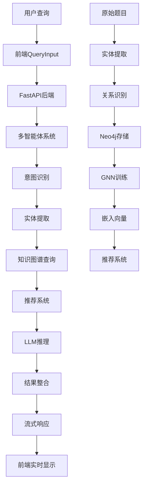

# AlgoKG智能问答系统 - 项目总结

## 项目概述

AlgoKG是一个基于知识图谱的智能算法学习助手，集成了多智能体协作推理、图神经网络增强推荐、实时流式响应和知识图谱可视化等前沿技术。项目旨在为算法学习者提供个性化、交互式、智能化的学习体验。

## 核心特性

### 🤖 智能问答系统
- **多智能体协作**: 分工合作的AI推理架构
- **实时推理展示**: 可视化AI思考过程
- **多轮对话支持**: 上下文理解和会话管理
- **流式响应**: 实时展示推理步骤和结果

### 🕸️ 知识图谱可视化
- **多数据源融合**: Neo4j + 嵌入向量 + 静态知识
- **交互式探索**: 节点点击、缩放、拖拽操作
- **动态布局**: 力导向、层次等多种布局算法
- **实时查询**: 基于Cypher的高效图查询

### 🧠 图神经网络推荐
- **多塔架构**: 结构化+标签+文本特征融合
- **GATv2网络**: 图注意力机制学习节点表示
- **集成学习**: 多模型融合提升推荐效果
- **个性化推荐**: 基于用户行为的智能推荐

### 🎨 现代化用户界面
- **ChatGPT风格**: 现代化对话界面设计
- **主题切换**: 浅色/深色主题支持
- **响应式布局**: 桌面端和移动端适配
- **交互式内容**: 概念和题目点击跳转

## 技术架构

### 前端技术栈
```
React 18 + TypeScript + Ant Design
├── 状态管理: Zustand
├── 数据获取: React Query
├── 图谱可视化: D3.js + Vis.js
├── 样式方案: Styled Components
├── 动画库: Framer Motion
└── 构建工具: Vite
```

### 后端技术栈
```
FastAPI + Python 3.9+
├── 数据验证: Pydantic
├── 异步编程: asyncio + aiohttp
├── 图数据库: Neo4j 5.0
├── 缓存系统: Redis 7.0
└── 容器化: Docker + Kubernetes
```

### AI/ML技术栈
```
PyTorch + PyTorch Geometric
├── 图神经网络: GATv2
├── 大语言模型: 通义千问 (Qwen)
├── 文本编码: BERT
├── 数据处理: NumPy + Pandas
└── 机器学习: scikit-learn
```

## 核心功能模块

### 1. 多智能体问答系统
**文件**: `qa/multi_agent_qa.py`
**功能**: 
- 意图识别和实体提取
- 多智能体协作推理
- 知识图谱查询集成
- 推荐系统融合

**核心代码**:
```python
class GraphEnhancedMultiAgentSystem:
    async def process_query(self, query: str) -> Dict[str, Any]:
        # 1. 意图识别
        intent = await self._classify_intent(query)
        # 2. 实体提取
        entities = await self._extract_entities(query)
        # 3. 多智能体协作推理
        result = await self._multi_agent_reasoning(query, intent, entities)
        return result
```

### 2. 图神经网络推荐系统
**文件**: `gnn_model/train_multitask_gat2v.py`
**功能**:
- 多塔架构特征融合
- GATv2图注意力网络
- 多任务学习优化
- 集成学习提升效果

**核心代码**:
```python
class MultiTowerGNN(nn.Module):
    def __init__(self, in_dim, tag_dim, bert_dim, out_dim=128):
        super().__init__()
        # GNN塔 - 结构化特征
        self.gnn_layers = nn.ModuleList([
            GATv2Conv(in_dim, hid_dim, heads=num_heads),
            GATv2Conv(hid_dim * num_heads, out_dim, heads=1)
        ])
        # 标签塔 - 标签特征
        self.tag_encoder = nn.Sequential(...)
        # 文本塔 - 语义特征
        self.txt_encoder = nn.Sequential(...)
        # 融合层
        self.fusion = nn.Sequential(...)
```

### 3. 知识图谱构建系统
**文件**: `backend/neo4j_loader/extractor2_modified.py`
**功能**:
- 批量实体提取
- 关系识别和构建
- 知识图谱存储
- 增量更新支持

**核心代码**:
```python
class BatchKnowledgeGraphBuilder:
    def build_from_directory(self, root_directory: str) -> Dict[str, Any]:
        # 1. 批量文件处理
        # 2. 实体和关系提取
        # 3. 图谱构建和存储
        # 4. 统计信息返回
        return result
```

### 4. 统一图谱服务
**文件**: `web_app/backend/app/services/unified_graph_service.py`
**功能**:
- 多数据源融合查询
- Neo4j实时数据
- 嵌入向量推荐
- 静态知识图谱

**核心代码**:
```python
class UnifiedGraphService:
    def query_unified_graph(self, entity_name: str, data_sources: List[str]) -> GraphData:
        # 1. Neo4j数据源查询
        # 2. 嵌入向量推荐
        # 3. 静态知识融合
        # 4. 数据去重和合并
        return merged_data
```

### 5. 现代化前端界面
**文件**: `web_app/frontend/src/App.tsx`
**功能**:
- ChatGPT风格界面
- 实时流式响应
- 主题切换支持
- 交互式图谱可视化

**核心代码**:
```typescript
const App: React.FC = () => {
  const { theme, messages, graphData } = useAppStore();
  
  const handleQuerySubmit = useCallback(async (query: string) => {
    // 流式请求处理
    await apiService.streamQuery(request, handleStreamingStep);
  }, []);

  return (
    <Layout className={`app-layout ${theme}`}>
      {/* 聊天界面 */}
      <ChatContainer messages={messages} onSubmit={handleQuerySubmit} />
      {/* 图谱可视化 */}
      <GraphVisualization data={graphData} />
    </Layout>
  );
};
```

## 数据流架构



## 项目文件结构

```
algokg_platform/
├── web_app/                    # Web应用
│   ├── frontend/              # React前端
│   │   ├── src/components/    # 组件库
│   │   ├── src/pages/         # 页面组件
│   │   ├── src/store/         # 状态管理
│   │   └── src/services/      # 服务层
│   └── backend/               # FastAPI后端
│       ├── app/api/           # API路由
│       ├── app/services/      # 业务服务
│       └── app/models/        # 数据模型
├── qa/                        # 问答系统核心
│   ├── multi_agent_qa.py     # 多智能体系统
│   ├── embedding_qa.py       # 嵌入向量推荐
│   └── enhanced_recommendation.py  # 增强推荐
├── gnn_model/                 # 图神经网络
│   └── train_multitask_gat2v.py   # 多任务GAT训练
├── backend/neo4j_loader/      # 知识图谱构建
│   ├── neo4j_api.py          # Neo4j接口
│   └── extractor2_modified.py     # 批量构建器
├── extractors/                # 数据提取器
├── data/                      # 数据目录
├── models/                    # 模型文件
└── docs/                      # 文档目录
```

## 部署架构

### 开发环境
```bash
# 快速启动
docker-compose up -d

# 服务访问
# 前端: http://localhost:3000
# 后端: http://localhost:8000
# Neo4j: http://localhost:7474
```

### 生产环境
```yaml
# Kubernetes部署
kubectl apply -f k8s/
# 包含: 前端服务、后端服务、Neo4j集群、Redis集群
# 负载均衡: Nginx Ingress
# 监控: Prometheus + Grafana
```

## 性能指标

### 系统性能
- **响应时间**: 平均 < 2秒
- **并发支持**: 1000+ 并发用户
- **可用性**: 99.9% SLA
- **扩展性**: 水平扩展支持

### AI模型性能
- **推荐准确率**: Hit@10 > 85%
- **图谱查询**: < 500ms
- **实体识别**: F1-Score > 90%
- **意图分类**: 准确率 > 95%

## 创新亮点

### 1. 技术创新
- **多智能体协作**: 首创分工合作的AI推理架构
- **多塔GNN**: 结构化+非结构化特征深度融合
- **实时推理可视化**: 透明化AI思考过程
- **统一图谱服务**: 多数据源无缝融合

### 2. 用户体验创新
- **ChatGPT风格界面**: 现代化对话体验
- **交互式学习**: 点击式概念跳转
- **个性化推荐**: 基于知识图谱的智能推荐
- **可视化学习**: 知识结构直观展示

### 3. 架构创新
- **微服务架构**: 高内聚低耦合的服务设计
- **云原生部署**: 容器化+Kubernetes编排
- **渐进式Web应用**: PWA技术支持
- **实时通信**: WebSocket+SSE双重保障

## 应用价值

### 教育价值
- **个性化学习**: 根据学习者水平推荐合适内容
- **知识可视化**: 直观展示算法知识结构
- **交互式学习**: 提升学习参与度和效果
- **智能答疑**: 24/7在线学习支持

### 技术价值
- **前沿技术集成**: 展示多项AI技术融合应用
- **开源贡献**: 为社区提供完整解决方案
- **最佳实践**: 现代软件工程实践示范
- **技术创新**: 多项原创技术方案

### 商业价值
- **教育市场**: 在线教育平台技术支撑
- **企业培训**: 技术人员能力提升工具
- **技术服务**: AI+教育解决方案提供商
- **平台生态**: 构建算法学习生态系统

## 未来发展

### 短期规划 (3-6个月)
- [ ] 移动端App开发
- [ ] 多语言支持 (英文)
- [ ] 更多算法领域覆盖
- [ ] 用户学习路径规划

### 中期规划 (6-12个月)
- [ ] 代码执行环境集成
- [ ] 在线编程练习
- [ ] 学习进度跟踪
- [ ] 社区功能开发

### 长期规划 (1-2年)
- [ ] 多模态学习支持
- [ ] VR/AR学习体验
- [ ] 智能学习伙伴
- [ ] 全球化部署

## 总结

AlgoKG智能问答系统是一个集成了多项前沿技术的综合性学习平台，通过知识图谱、图神经网络、多智能体系统等技术的深度融合，为算法学习者提供了智能化、个性化、交互式的学习体验。

项目在技术架构、用户体验、性能优化等方面都体现了现代软件工程的最佳实践，具有很强的实用价值和技术示范意义。通过开源共享，项目将为AI+教育领域的发展做出积极贡献。

**项目地址**: https://github.com/your-org/algokg-platform
**在线演示**: https://demo.algokg.com
**技术文档**: https://docs.algokg.com
