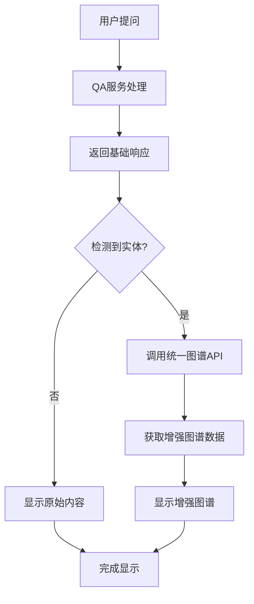

# 图谱数据增强改进

## 问题描述

用户反馈答案中嵌入的图谱和独立图谱页面显示的相关节点不一致，嵌入版本不够准确。原因是：

1. **嵌入图谱**：使用QA服务生成的简化图谱数据 (`response.graph_data`)
2. **独立图谱**：使用统一图谱API (`/api/v1/graph/unified/query`) 获取完整准确的数据

## 解决方案

### 🔧 核心改进

修改 `MessageItem.tsx` 组件，使其使用与独立图谱页面相同的API来获取图谱数据：

1. **统一数据源**：使用 `/api/v1/graph/unified/query` API
2. **增强数据**：支持多数据源融合 (Neo4j + Embedding)
3. **智能回退**：优先使用增强数据，回退到原始数据
4. **状态管理**：添加加载状态和错误处理

### 📋 实现细节

#### 1. 状态管理
```typescript
const [enhancedGraphData, setEnhancedGraphData] = useState<any>(null);
const [graphLoading, setGraphLoading] = useState(false);
```

#### 2. 数据获取函数
```typescript
const fetchEnhancedGraphData = async (entityName: string) => {
  const response = await fetch('/api/v1/graph/unified/query?data_sources=neo4j&data_sources=embedding', {
    method: 'POST',
    headers: { 'Content-Type': 'application/json' },
    body: JSON.stringify({
      entity_name: entityName.trim(),
      depth: 2,
      limit: 50
    }),
  });
  // 处理响应...
};
```

#### 3. 自动触发
```typescript
React.useEffect(() => {
  if (response?.entities && response.entities.length > 0 && !enhancedGraphData && !graphLoading) {
    const mainEntity = response.entities[0];
    fetchEnhancedGraphData(mainEntity);
  }
}, [response?.entities, enhancedGraphData, graphLoading]);
```

#### 4. 智能显示
```typescript
<InlineKnowledgeGraph
  graphData={enhancedGraphData || response.graph_data}
  entities={response.entities}
  isEnhanced={!!enhancedGraphData}
  // ...其他props
/>
```

### 🎯 功能特性

#### 数据来源优先级
1. **增强图谱数据** (优先)：通过统一API获取的完整数据
2. **原始图谱数据** (回退)：QA服务生成的简化数据

#### 视觉标识
- 增强数据会显示 "增强数据" 标签
- 加载状态显示进度指示器
- 错误处理和用户反馈

#### 性能优化
- 只在有实体时才获取数据
- 避免重复请求
- 异步加载不阻塞UI

### 📊 API对比

| 特性 | 原始图谱API | 统一图谱API |
|------|-------------|-------------|
| 数据源 | QA服务简化数据 | Neo4j + Embedding |
| 节点数量 | 较少 | 更多更完整 |
| 关系准确性 | 基础 | 高精度 |
| 实时性 | 静态 | 实时查询 |
| 多源融合 | ❌ | ✅ |

### 🔄 工作流程



### 🎨 用户体验改进

#### 加载体验
- 显示加载状态："正在加载增强图谱数据..."
- 渐进式加载：先显示基础内容，再加载图谱

#### 视觉反馈
- "增强数据" 标签标识数据来源
- 更丰富的节点和关系信息
- 与独立图谱页面一致的显示效果

#### 错误处理
- 网络错误时回退到原始数据
- 静默失败，不影响用户体验
- 控制台日志便于调试

### 🧪 测试建议

#### 功能测试
1. 提问包含明确实体的问题
2. 观察是否显示"增强数据"标签
3. 对比嵌入图谱和独立图谱的一致性

#### 性能测试
1. 检查网络请求是否合理
2. 验证加载状态显示
3. 测试错误情况的处理

#### 兼容性测试
1. 确保原有功能不受影响
2. 验证回退机制正常工作
3. 测试不同类型实体的处理

### 📝 配置说明

#### API参数
- `depth: 2` - 查询深度
- `limit: 50` - 节点数量限制
- `data_sources: ['neo4j', 'embedding']` - 数据源

#### 可调整参数
```typescript
// 在 fetchEnhancedGraphData 函数中
body: JSON.stringify({
  entity_name: entityName.trim(),
  depth: 2,        // 可调整查询深度
  limit: 50        // 可调整节点数量
})
```

### 🔮 未来扩展

#### 可能的改进
- [ ] 缓存机制减少重复请求
- [ ] 用户偏好设置（数据源选择）
- [ ] 更细粒度的加载状态
- [ ] 图谱数据预加载

#### 高级功能
- [ ] 实时图谱更新
- [ ] 个性化图谱推荐
- [ ] 图谱数据分析
- [ ] 交互式图谱编辑

## 总结

通过这个改进，嵌入图谱现在使用与独立图谱页面相同的高质量数据源，确保了数据的一致性和准确性。用户将看到更完整、更准确的知识图谱，提升了整体的学习体验。
