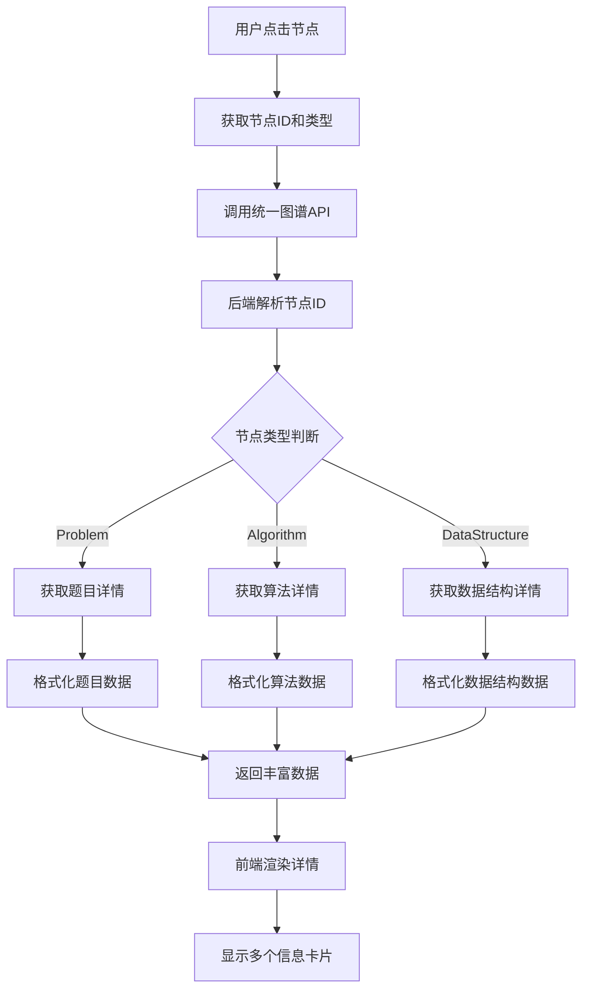

# 节点详情增强改进

## 问题描述

用户反馈嵌入图谱中点击节点显示的属性信息太简单，希望像独立图谱页面一样显示丰富的节点属性。

原有显示：
```
完全平方数
Problem
基本信息
名称：完全平方数
类型：Problem
```

期望显示：包含算法、数据结构、复杂度、相关题目、解决方案等丰富信息。

## 解决方案

### 🔧 后端改进

#### 1. 统一图谱服务增强
修改 `unified_graph_service.py` 中的节点详情方法，返回格式化的丰富数据：

**题目详情增强**：
```python
def _get_problem_details(self, title: str) -> Dict[str, Any]:
    # 获取完整题目信息
    problem_info = self.neo4j_api.get_problem_by_title(title)
    similar_problems = self.neo4j_api.get_similar_problems(title, limit=5)
    
    # 格式化返回数据
    return {
        "basic_info": {
            "title": problem_info.get("title", title),
            "type": "Problem",
            "description": problem_info.get("description", ""),
            "difficulty": problem_info.get("difficulty", ""),
            "platform": problem_info.get("platform", ""),
            "category": problem_info.get("category", ""),
            "url": problem_info.get("url", "")
        },
        "algorithms": [...],
        "data_structures": [...],
        "techniques": [...],
        "related_problems": [...],
        "complexity": {...},
        "solutions": [...],
        "insights": [...],
        "step_by_step": [...]
    }
```

**算法详情增强**：
```python
def _get_algorithm_details(self, name: str) -> Dict[str, Any]:
    return {
        "basic_info": {...},
        "related_problems": [...],
        "complexity": {...},
        "applications": [...],
        "advantages": [...],
        "disadvantages": [...]
    }
```

**数据结构详情增强**：
```python
def _get_datastructure_details(self, name: str) -> Dict[str, Any]:
    return {
        "basic_info": {...},
        "related_problems": [...],
        "operations": [...],
        "complexity": {
            "access": "...",
            "search": "...",
            "insertion": "...",
            "deletion": "..."
        },
        "advantages": [...],
        "disadvantages": [...],
        "use_cases": [...]
    }
```

### 🎨 前端改进

#### 1. InlineKnowledgeGraph组件增强
添加更多详情展示部分：

**复杂度分析增强**：
- 时间复杂度、空间复杂度
- 数据结构的访问、搜索、插入、删除复杂度
- 不同颜色标签区分不同类型复杂度

**新增展示部分**：
- 相关技巧列表
- 解决方案详情（包含复杂度）
- 关键洞察
- 优缺点分析

#### 2. 数据格式兼容
确保前端能正确解析后端返回的丰富数据格式，支持：
- 嵌套对象结构
- 数组数据展示
- 条件渲染（只在有数据时显示）
- 错误处理和回退显示

### 📊 数据结构对比

| 信息类型 | 原始显示 | 增强显示 |
|----------|----------|----------|
| 基本信息 | 名称、类型 | 名称、类型、描述、难度、平台、分类、URL |
| 算法信息 | ❌ | 相关算法列表，包含描述和分类 |
| 数据结构 | ❌ | 相关数据结构列表，包含描述和分类 |
| 复杂度 | ❌ | 时间/空间复杂度，数据结构操作复杂度 |
| 相关题目 | ❌ | 相似题目列表，包含难度和相似度 |
| 解决方案 | ❌ | 多种解法，包含复杂度分析 |
| 关键洞察 | ❌ | 重要知识点和技巧 |
| 优缺点 | ❌ | 算法/数据结构的优势和劣势 |

### 🔄 工作流程



### 🎯 显示效果

#### 题目节点详情
- **基本信息**：标题、类型、描述、难度、平台、分类
- **相关算法**：算法名称、描述、分类
- **数据结构**：数据结构名称、描述、分类
- **复杂度分析**：时间复杂度、空间复杂度
- **相关题目**：相似题目、难度、相似度
- **解决方案**：多种解法、复杂度分析
- **关键洞察**：重要知识点和技巧

#### 算法节点详情
- **基本信息**：名称、类型、描述、分类
- **相关题目**：使用该算法的题目列表
- **复杂度分析**：时间复杂度、空间复杂度
- **应用场景**：算法的应用领域
- **优缺点分析**：算法的优势和劣势

#### 数据结构节点详情
- **基本信息**：名称、类型、描述、分类、特性
- **相关题目**：使用该数据结构的题目
- **操作复杂度**：访问、搜索、插入、删除复杂度
- **优缺点分析**：数据结构的优势和劣势
- **使用场景**：适用的应用场景

### 🎨 视觉改进

#### 颜色编码
- **绿色**：时间复杂度、优点
- **蓝色**：空间复杂度、基本信息
- **紫色**：搜索复杂度
- **橙色**：插入复杂度、警告信息
- **红色**：删除复杂度、缺点
- **青色**：访问复杂度

#### 布局优化
- 使用Card组件分组显示不同类型信息
- List组件展示数组数据
- Tag组件突出重要属性
- Space组件保持良好间距
- 条件渲染避免空白区域

### 🧪 测试建议

#### 功能测试
1. 点击不同类型节点（题目、算法、数据结构）
2. 验证详情信息的完整性和准确性
3. 检查数据格式化是否正确
4. 测试错误情况的处理

#### 视觉测试
1. 检查信息卡片的布局和间距
2. 验证颜色编码的一致性
3. 测试长文本的显示效果
4. 确认响应式设计的适配

#### 性能测试
1. 测试大量数据的渲染性能
2. 验证API响应时间
3. 检查内存使用情况
4. 测试并发请求的处理

### 📝 配置说明

#### API端点
- 统一节点详情：`/api/v1/graph/unified/node/{node_id}/details?node_type={type}`
- 支持的节点类型：Problem、Algorithm、DataStructure

#### 前端配置
```typescript
// 节点详情接口
interface NodeDetailInfo {
  basic_info: {
    title: string;
    type: string;
    description?: string;
    difficulty?: string;
    platform?: string;
    category?: string;
    url?: string;
  };
  algorithms?: Array<{name: string; description: string; category: string}>;
  data_structures?: Array<{name: string; description: string; category: string}>;
  techniques?: Array<{name: string; description: string}>;
  related_problems?: Array<{title: string; difficulty: string; similarity_score?: number}>;
  complexity?: {
    time?: string;
    space?: string;
    access?: string;
    search?: string;
    insertion?: string;
    deletion?: string;
  };
  solutions?: Array<{approach: string; description: string; time_complexity: string; space_complexity: string}>;
  insights?: Array<{title: string; content: string}>;
  advantages?: string[];
  disadvantages?: string[];
}
```

### 🔮 未来扩展

#### 可能的改进
- [ ] 节点详情缓存机制
- [ ] 更多节点类型支持
- [ ] 交互式复杂度图表
- [ ] 代码示例展示
- [ ] 学习路径推荐

#### 高级功能
- [ ] 节点详情编辑功能
- [ ] 个性化信息展示
- [ ] 详情信息导出
- [ ] 多语言支持

## 总结

通过这个改进，嵌入图谱的节点详情现在显示丰富的信息，包括基本信息、相关算法、数据结构、复杂度分析、相关题目、解决方案、关键洞察等。用户可以获得与独立图谱页面一致的详细信息，大大提升了学习体验。
