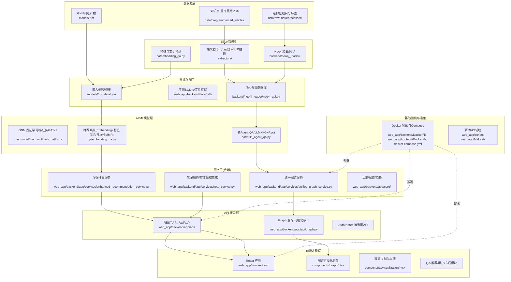

# 技术架构总览

## 架构总览
- **目标**: 支撑算法学习/问答/知识图谱/推荐/可视化的一体化平台。
- **风格**: 分层与组件化，KG+LLM+GNN混合智能，前后端分离，容器化部署。
- **核心路径**: 数据源 → ETL/抽取构建 → 存储 → AI/ML → 服务 → API → 前端。

### 架构示意
(建议在支持Mermaid的环境中查看)

---

## 分层说明

### 一、数据源层
- **来源**
  - `data/programmercarl_articles/`：知识点与题目原文（txt），用于实体/关系抽取。
  - `data/raw/`、`data/processed/`：题目、标签、图结构等中间/清洗产物。
  - 模型产物/对齐文件：`models/*.pt`、`data/raw/entity_id_to_title.json` 等。
- **作用**：为构建知识图谱与训练/推理提供原始与半结构化素材。

### 二、ETL/构建层
- **抽取与转换**：
  - `extractors/`：`extract_knowledgePoint.py`、`extract_problem_entity.py` 将文本转为实体/关系。
  - 产出 JSON/结构化数据，支撑后续入图与特征工程。
- **入图与同步**：
  - `backend/neo4j_loader/neo4j_api.py`、`extractor2_modified.py`：批量导入实体、关系；提供通用查询方法。
- **特征与索引**：
  - `qa/embedding_qa.py`：加载并标准化向量、构建标签向量与IDF权重，准备推荐所需索引。

### 三、数据存储层
- **图数据库（主知识底座）**：
  - Neo4j，通过 `backend/neo4j_loader/neo4j_api.py` 访问；实体：Problem/Algorithm/DataStructure/Technique 等，关系：USES_ALGORITHM、SIMILAR_TO、PREREQUISITE_OF 等。
- **事务/应用数据**：
  - `web_app/backend/data/*.db`：用户、笔记等业务数据（SQLite）。
- **模型与嵌入**：
  - `models/*.pt`、`data/gnn/`：GNN嵌入、训练产物；被推荐/QA系统加载。

### 四、AI/ML 模型层
- **GNN 表征学习**：
  - `gnn_model/train_multitask_gat2v.py`：多任务 GATv2 训练，产出实体表征，用于相似度与下游任务。
- **推荐系统（Hybrid + MMR）**：
  - `qa/embedding_qa.py` 与 `web_app/backend/app/services/enhanced_recommendation_service.py`：embedding + 标签加权（IDF）混合相似度；MMR 结果去冗增多样性；学习路径与理由生成。
- **多Agent QA（LLM + KG + Rec）**：
  - `qa/multi_agent_qa.py`：Analyzer/KG Retriever/Concept Explainer/Similar Finder/Integrator 协同；利用 Neo4j + 推荐系统 + LLM 整合生成结构化答案与推理路径。

### 五、服务层（后端）
- **统一图谱服务**：
  - `web_app/backend/app/services/unified_graph_service.py`：融合 Neo4j 与推荐结果为统一图数据（`GraphData`），提供节点详情/相似关系等能力。
- **笔记服务**：
  - `web_app/backend/app/services/note_service.py`：上传/解析/内容分析/实体抽取，集成 Neo4j 并回写分析数据。
- **增强推荐服务**：
  - `web_app/backend/app/services/enhanced_recommendation_service.py`：与前端/QA联动的推荐封装。
- **核心基础**：
  - `web_app/backend/app/core/`：鉴权、配置、依赖装配（Neo4j API、RecommendationSystem 实例等）。

### 六、API 接口层
- `web_app/backend/app/api/`：FastAPI 路由集合。
  - `graph.py`：统一图谱查询、节点详情、相似检索等。
  - `auth.py`、`notes.py` 等：认证、笔记上传/抽取/查询。
- 输出 JSON，供前端与外部调用；鉴权基于 JWT（见 `core/auth.py`）。

### 七、前端表现层（React + Ant Design）
- 入口：`web_app/frontend/src/`，现代布局在 `components/layout/`。
- 图谱可视化：
  - `components/graph/GraphVisualization.tsx`、`EnhancedGraphVisualization.tsx`：vis-network 渲染、层次/力导向布局、交互事件（点击节点取详情）。
- 算法可视化：
  - `components/visualization/AlgorithmVisualizer.tsx`：可执行模板 + 步骤流可视化、速度控制、单步/播放。
- QA/推荐/用户：
  - `components/qa/*`、`components/recommendation/SmartRecommendationSystem.tsx`、`components/auth/*`。
- 路由/页面：`pages/*`（如 `UnifiedGraphPage.tsx`、`AlgorithmVisualizationPage.tsx`）。

### 八、基础设施与运维
- 容器化：
  - 后端/前端 `Dockerfile` 与顶层 `docker-compose.yml`。
- 脚本与工具：
  - `web_app/scripts/*`、`Makefile`：启动、检查、修复脚本。
- 依赖管理：
  - 后端 `requirements.txt`，前端 `package.json`。

### 九、安全与权限
- 鉴权与会话：
  - `web_app/backend/app/core/auth.py`、`models/auth.py`；JWT 认证、用户注册/登录、权限控制。
- 数据访问控制：
  - API 层对笔记等资源按用户隔离；Neo4j 查询由服务层受控发起。

### 十、观测与日志
- 运行日志：
  - QA与KG构建日志：`knowledge_graph_builder.log`（根目录与 backend 下都有同名日志）。
- 关键路径打点：
  - 多Agent QA、推荐调用均在模块内记录步骤/耗时/置信度（见 `qa/multi_agent_qa.py`）。

---

## 关键数据流
1) 推荐数据流
- 输入题目 → `qa/embedding_qa.py` 计算混合相似度 → MMR 去冗与解释 → API 返回 → 前端 `SmartRecommendationSystem.tsx` 展示。

2) QA数据流
- 用户查询 → `multi_agent_qa.py` Analyzer → KG 检索/概念解释/推荐整合 → 结构化答案 + 推理路径 → 前端 QA 组件展示。

3) 笔记-图谱集成流
- 前端上传 → `note_service.py` 解析/分析/抽取 → 写入 Neo4j（`neo4j_integration_service`） → 统一图谱服务查询 → 前端图谱展示。

---

## 技术选型与理由
- 图数据库：Neo4j（天然图关系建模与查询、路径与相似关系便捷）。
- 表征学习：GATv2（适配图结构、可并入多任务损失）。
- 推荐算法：Embedding + 标签（IDF权重）混合相似度 + MMR 多样性，兼顾准确性与覆盖度。
- LLM 增强：多Agent编排，确保“来源可解释 + 分数不篡改”。
- 前端：React + Ant Design + vis-network，快速实现交互式可视化与业务界面。
- 后端：FastAPI，轻量高效，易于编排依赖与路由。
- 部署：Docker/Compose，一键化开发与交付。

---

## 代码位置速查
- KG API：`backend/neo4j_loader/neo4j_api.py`
- 推荐系统：`qa/embedding_qa.py`，`web_app/backend/app/services/enhanced_recommendation_service.py`
- 多Agent QA：`qa/multi_agent_qa.py`
- 统一图谱服务：`web_app/backend/app/services/unified_graph_service.py`
- 笔记服务：`web_app/backend/app/services/note_service.py`
- 前端图谱：`web_app/frontend/src/components/graph/`
- 前端算法可视化：`web_app/frontend/src/components/visualization/`
- API：`web_app/backend/app/api/`

---

## 风险与改进建议
- Neo4j 单点与数据规模：建议引入备份/只读副本，评估分片与缓存。
- 嵌入与标签权重版本化：增加版本标记与线上回滚能力。
- 多Agent 调用成本与稳定性：引入降级与结果缓存，监控 LLM 超时/失败率。
- 前端大图渲染性能：对超大图采用分页/裁剪/渐进式加载与节点聚合。

